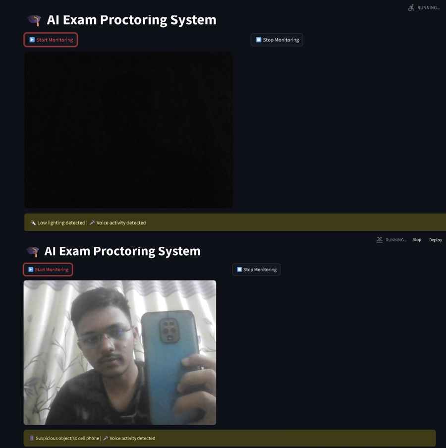

# AI-Exam-Proctor: Smart Proctoring System using Computer Vision and Audio Analysis 🎓🛡️

This project is a real-time AI-powered proctoring system that monitors students during online exams using webcam video and microphone input. It detects suspicious activities such as object presence, low lighting conditions, face absence, and voice activity.

## 🚀 Features

- 🎥 Face detection using OpenCV
- 🧠 Suspicious object detection using YOLOv8 (e.g., phones, books, laptops)
- 🌑 Environment visibility check (e.g., low light detection)
- 🎤 Voice activity detection using Silero VAD
- 🧪 Simple Streamlit interface to start/stop monitoring
- 📋 Real-time visual alerts

## 🗂️ Project Structure

```
├── app.py               # Main Streamlit application
├── detect_objects.py    # Object detection using YOLOv8
├── face_detect.py       # Face presence detection
├── visibility.py        # Lighting condition check
├── voice_alert.py       # Voice activity detection
├── webcam.py            # Webcam frame capture and release
```

## 🛠️ Installation

1. **Clone the repository**

```bash
git clone https://github.com/yourusername/AI-Exam-Proctor.git
cd AI-Exam-Proctor
```

2. **Create a virtual environment and install dependencies**

```bash
pip install -r requirements.txt
```

<sub>_(You’ll need `opencv-python`, `streamlit`, `ultralytics`, `torch`, `sounddevice`, `torchaudio`, `Pillow`)_</sub>

3. **Download YOLOv8 weights**

The model uses the lightweight YOLOv8n model:

```bash
# Handled automatically via ultralytics package
```

4. **Run the app**

```bash
streamlit run app.py
```

## 🖥️ Requirements

- Python 3.8+
- Webcam and microphone access
- Compatible GPU (optional, for better YOLOv8 performance)

## ⚠️ Detected Events

- **📱 Suspicious Object:** Phone, Book, or Laptop
- **🔦 Low Light:** Insufficient lighting in the environment
- **🧑 Face Not Detected:** Student may not be in front of the camera
- **🎤 Voice Detected:** Background noise or talking

## 🧾 Example Output

Below is a sample of the real-time monitoring interface:


## 📌 Notes

- This is a prototype for educational/demo use only. For deployment, consider secure data handling, multi-person detection, and better model tuning.
- Alerts are visible on screen but not logged—this can be added with simple file logging.

## 👨‍💻 Author

Prajwal Mewade